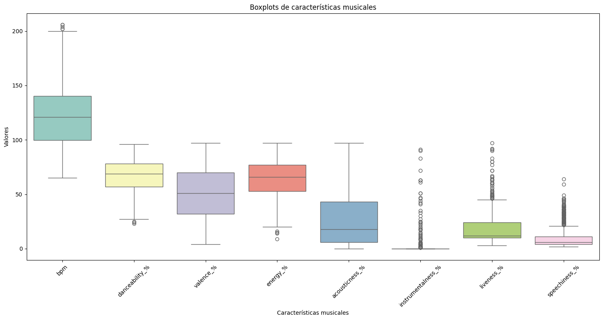
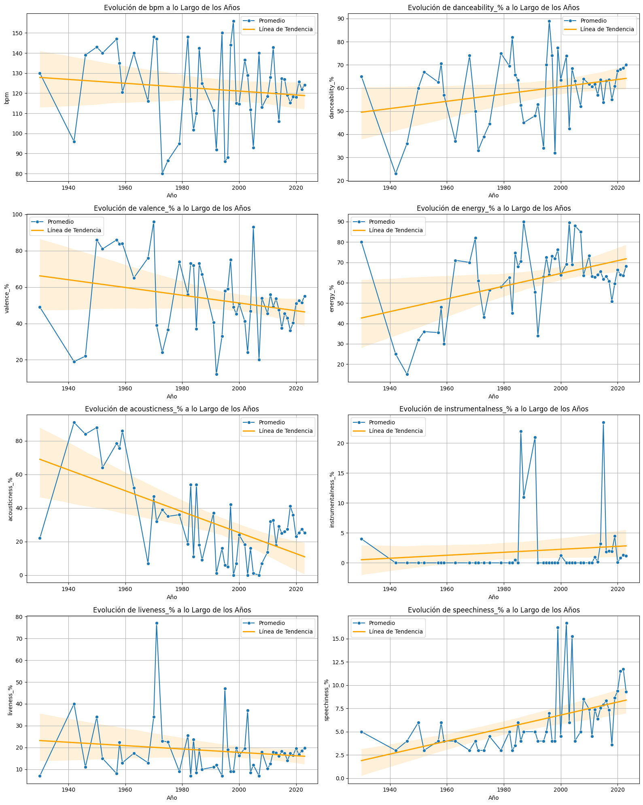
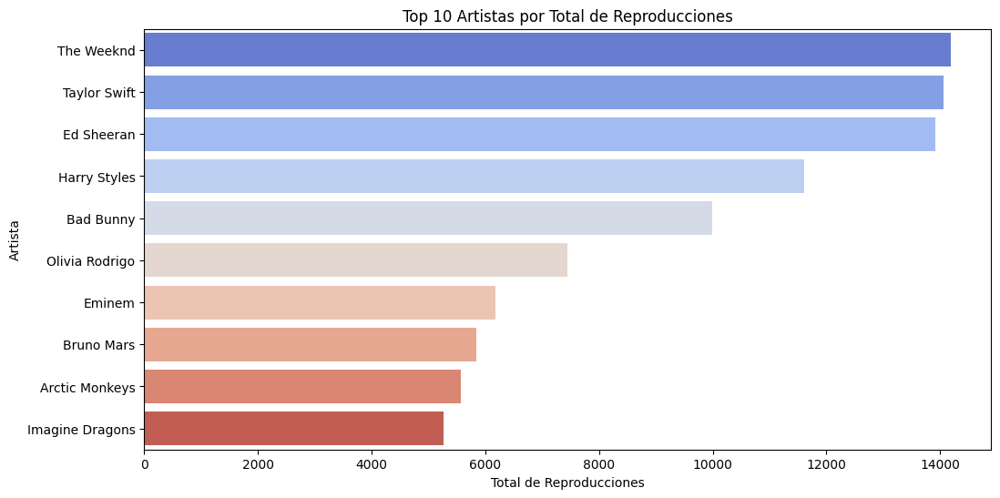
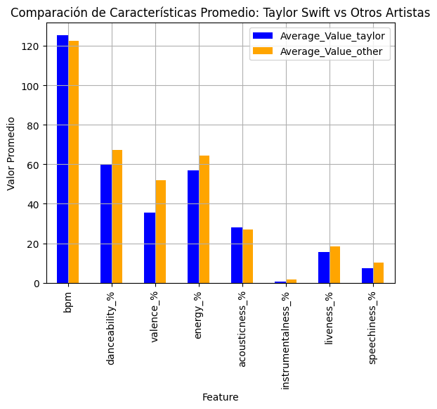
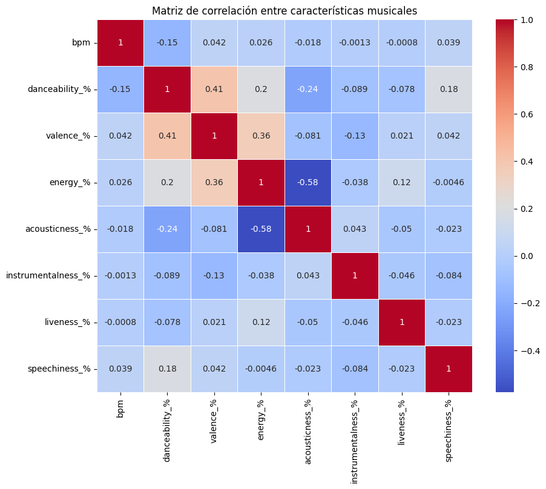
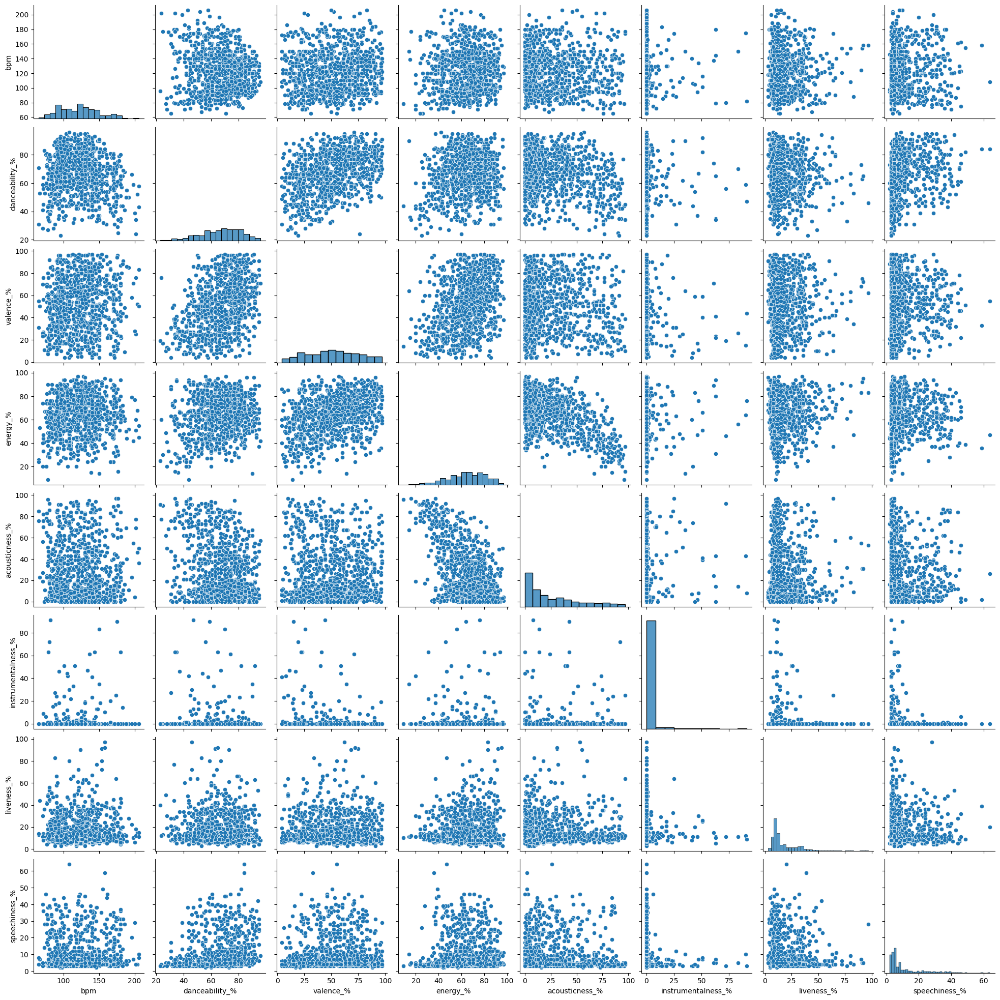

# Análisis de Canciones Populares en Spotify - 2023

## Autor
Proyecto desarrollado por **Sergio Grigorow**

## Descripción del Proyecto
Este proyecto de análisis de datos explora un conjunto de canciones populares de Spotify, con información adicional sobre la presencia de estas canciones en otras plataformas de música (Apple Music, Deezer, Shazam) y varios atributos musicales como la energía, la acústica, la bailabilidad, entre otros. El objetivo principal es explorar patrones en funciones de audio para comprender tendencias y preferencias en canciones populares.

El proyecto también incluye un enfoque particular en la artista Taylor Swift, artista mas popular de la actualidad, comparando su éxito con el promedio de otros artistas y analizando los factores que podrían explicar su popularidad.

## Herramientas Utilizadas
- **Python**: Lenguaje principal de programación.
- **Pandas**: Para manipulación y análisis de datos.
- **Seaborn & Matplotlib**: Para la visualización de datos.
- **Jupyter Notebooks**: Para la ejecución interactiva del análisis.

## Conclusiones Principales
### 1. **Análisis General de las Canciones**
   - **BPM**: La media 122 BPM indica que el tempo promedio de las canciones más populares es de 122 beats por minuto. Este tempo se considera moderadamente rápido y es típico de muchos géneros de música pop, dance, y rock contemporáneo. Sin embargo, el amplio rango intercuartílico (41 BPM) sugiere que hay una gran variedad en los tempos de las canciones populares. Esto indica que no hay un único tempo "mágico" que garantice el éxito, sino que las canciones populares abarcan desde ritmos más lentos hasta muy rápidos
   - **Bailabilidad**: Con una media de 67% y una mediana de 69%, la mayoría de las canciones son altamente bailables. El rango intercuartílico de 57% a 78% sugiere que la bailabilidad es una característica consistente en las canciones populares
   - **Valence**: La valencia media de 51.4% indica un equilibrio entre canciones percibidas como positivas y negativas. La amplia desviación estándar de 23.5% sugiere gran variedad en el "estado de ánimo" de las canciones populares.
   - **Energia**: Con una media de 64.3% y una mediana de 66%, las canciones tienden a ser energéticas. El rango intercuartílico de 53% a 77% indica que la mayoría de las canciones populares mantienen niveles de energía de moderados a altos.
   - **Acústica**: La baja media (27.1%) y mediana (18%) de acústica sugieren una preferencia por producciones más electrónicas
   - **Instrumentalidad**: Con una mediana de 0% y un tercer cuartil también en 0%, la gran mayoría de las canciones populares tienen poca o ninguna instrumentalidad. Esto sugiere una fuerte preferencia por canciones con voces prominentes
   - **Liveness**: La baja media (18.2%) y mediana (12%) de liveness indican que la mayoría de las canciones populares no tienen una fuerte sensación de interpretación en vivo. Esto sugiere una preferencia por producciones de estudio pulidas.
   - **Speechiness**: Con una media de 10.1% y una mediana de 6%, la mayoría de las canciones tienen niveles bajos de speechiness. Esto indica que, aunque las voces son importantes, las canciones populares tienden a favorecer el canto sobre el habla o rap.



### 2. Evolucion de Caracteristicas Musicales en el tiempo:
   - **BPM**: El BPM (beats per minute) ha mostrado una tendencia a disminuir ligeramente a lo largo de los años, aunque con mucha fluctuación. Sin embargo, en general, se observa una tendencia hacia canciones con un ritmo ligeramente más lento.
   - **Bailabilidad**: La bailabilidad ha experimentado un aumento gradual a lo largo del tiempo, lo que sugiere que las canciones se han vuelto más bailables en general.
   - **Valence**: La valencia, que representa la positividad de una canción, ha mostrado una tendencia a disminuir ligeramente. Esto podría indicar que las canciones más recientes tienden a tener una tonalidad emocional menos positiv
   - **Energia**: La energía de las canciones ha mostrado una tendencia similar a la danceability, con un aumento gradual a lo largo de los años. Esto sugiere que las canciones más recientes tienden a ser más enérgicas y menos relajadas.
   - **Acústica**: La acousticness ha disminuido significativamente a lo largo del tiempo, lo que indica que las canciones se han vuelto menos acústicas y más producidas digitalmente
   - **Instrumentalidad**: El instrumentalidad también ha disminuido, lo que sugiere que las canciones ahora contienen más elementos vocales y menos instrumentos en solitario. 
   - **Liveness**:La liveness ha mostrado una tendencia a disminuir ligeramente, lo que podría indicar que las grabaciones se han vuelto más controladas y menos "en vivo".
   - **Speechiness**: La speechiness ha aumentado ligeramente a lo largo de los años, lo que sugiere que las canciones ahora contienen más elementos hablados o rapeados.


   
### 3. **Análisis por Artista**
   - El análisis de artistas muestra que aquellos con más de 5 canciones en el conjunto de datos tienden a dominar las listas de reproducciones. Entre ellos, **Bad Bunny**, **Taylor Swift** ,**The Weekend** y **Ed Sheeran** se destacan por el volumen de reproducciones acumuladas.
   - **Taylor Swift** fue la artista con mayor número de reproducciones, destacando consistentemente a lo largo del año en múltiples plataformas.



### 4. **Taylor Swift vs. Promedio General**
En comparación con el promedio de otros artistas en cuanto a caracteristicas musicales, las canciones de Taylor Swift tienden a:
   - **BPM**: Tienden a tener un BPM (beats per minute) ligeramente más alto en comparación con el promedio de otros artistas. Esto sugiere que sus canciones, en general, tienen un ritmo más acelerado, sin ser tan marcada esta diferencia.
   - **Bailabilidad**: La bailabilidad es ligeramente inferior al promedio. Esto indica que, aunque sus canciones son disfrutables, pueden no ser tan bailables como las de otros artistas, lo que podría estar relacionado con el ritmo más lento y posiblemente con un estilo musical más introspectivo.
   - **Valence**: La valencia, que mide la positividad de una canción, es ligeramente más baja en las canciones de Taylor Swift. Esto sugiere que, en promedio, sus canciones transmiten emociones ligeramente menos positivas en comparación con otros artistas, lo que podría estar relacionado con temáticas más introspectivas o melancólicas que aborda en sus letras..
   - **Energy**: La energía de las canciones de Taylor Swift es notablemente menor que el promedio. Esto refuerza la idea de que sus canciones tienden a ser más relajadas y menos enérgicas


 
## Visualizaciones Principales
A lo largo del análisis se generaron varias visualizaciones clave, incluyendo:

1. **Gráficos de Caja**: Comparaciones de los atributos musicales clave como BPM, energía, acústica, etc.
2. **Matriz de Correlación**: Visualización de la relación entre las variables cuantitativas (bailabilidad, energía, etc.) y las reproducciones.

4. **Gráficos de Dispersión**: Correlacion entre las diferentes caracteristicas musicales.

6. **Gráfico de Barras - Top Artistas por Reproducciones Totales**: Visualización de los 10 artistas más reproducidos.
7. **Análisis Temporal**: Gráficos de línea que muestran la evolucion de las caracteristicas musicales en el tiempo.


## Instrucciones de Uso
1. Clona este repositorio:  
   ```bash
   git clone https://github.com/grigorow1974/Proyecto_Spotify.git
